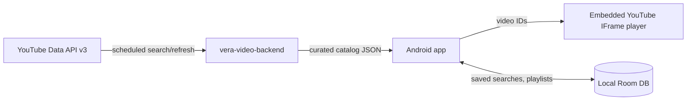

# Vera-Video — Project Plan

An Android app for discovering, organizing, and playing YouTube videos related to
**The Vera Project**, backed by a small service (`vera-video-backend`) that builds and
periodically refreshes the video catalog using the YouTube Data API.

- **This repo (`vera-video`)** — the Android app.
- **`vera-video-backend`** — a separate repository holding the catalog-builder job and
  the read API the app consumes.

---

## 1. System overview

The backend does the expensive, quota-limited work (querying YouTube, filtering noise,
deduplicating) on a schedule and exposes a clean, cheap-to-serve catalog. The app never
talks to the YouTube Data API directly — it only fetches the curated catalog and plays
videos through the embedded player. This keeps the API key server-side, conserves quota
(one consumer instead of N devices), and lets search in the app run instantly against
local data.

---

## 2. vera-video-backend

### Language and platform: TypeScript on Cloudflare Workers

**Why:**
- The workload is tiny and periodic — a cron-triggered job plus a read-only JSON API.
  A serverless platform with built-in cron (Workers **Cron Triggers**) fits exactly;
  there is no server to patch or pay for while idle, and the free tier comfortably
  covers this traffic.
- **TypeScript** gives typed models for the YouTube API responses and the catalog
  schema shared with documentation, with first-class support on Workers.
- **D1** (Workers' SQLite) stores the catalog; it's queryable (dedupe, upserts,
  "last seen" tracking) and free at this scale. A cached JSON snapshot of the full
  catalog can additionally be written to **KV** or **R2** so the app's common request
  ("give me everything") is a single cheap read.

*Alternative considered:* a Python script + GitHub Actions cron committing a JSON file
to a repo/Pages. Even simpler, but no real API surface, awkward incremental updates,
and public commit history of every refresh. Workers is nearly as simple and grows
better (e.g., adding playlist-sharing endpoints later).

### YouTube Data API usage

- **API:** YouTube Data API v3, server-side API key (restricted to the Workers egress),
  stored as a Worker secret.
- **Discovery queries** (cron, e.g. every 6–24 h):
  - `search.list` for terms like `"The Vera Project"`, `"Vera Project Seattle"`,
    plus channel-scoped listing (`playlistItems.list` on the uploads playlist) for
    known channels — starting with The Vera Project's own channel.
  - `search.list` costs **100 quota units per call** against a 10,000/day default
    quota, so the schedule and page depth are tuned to stay well under quota
    (channel uploads via `playlistItems.list` cost only 1 unit — prefer it wherever
    a channel is known).
- **Relevance filtering** — "Vera" is a noisy term (TV series, Vera Rubin Observatory,
  personal names). The job filters results by:
  - channel allowlist (always keep) and blocklist (always drop),
  - keyword rules on title/description/tags (e.g. must contain "Vera Project" or
    match venue/band/event patterns),
  - manual overrides table for edge cases.
- **Refresh pass:** periodically re-fetch `videos.list` (1 unit, batched 50 ids/call)
  for cataloged videos to update titles/thumbnails/durations and mark
  deleted/private videos.

### Data model (D1)

| table | purpose |
|---|---|
| `videos` | video_id, title, channel_id/title, published_at, duration, thumbnail URL, description snippet, first_seen, last_seen, status |
| `channels` | allowlist/blocklist + metadata |
| `overrides` | manual include/exclude by video_id |
| `crawl_log` | per-run stats for debugging quota/filter behavior |

### API surface (read-only, JSON)

- `GET /catalog` — full catalog (ETag/If-None-Match so the app syncs cheaply).
- `GET /catalog?since=<timestamp>` — incremental delta.
- Optionally later: `POST /playlists` + `GET /playlists/{id}` for shareable playlists.

### Tooling

- `wrangler` for local dev, deploys, secrets, cron config.
- Vitest with `@cloudflare/vitest-pool-workers` for unit tests of filtering/dedupe.
- GitHub Actions: typecheck, test, deploy on merge to main.

---

## 3. Android app (this repo)

### Language and toolkit: Kotlin + Jetpack Compose

**Why:**
- **Kotlin** is Google's primary language for Android; all current Jetpack libraries,
  docs, and samples assume it. Coroutines/Flow map naturally onto the app's
  sync-then-observe data flow.
- **Jetpack Compose** (Material 3) over XML views: this app is mostly lists, search
  fields, and detail screens — exactly what Compose expresses concisely, and it's the
  current default for new Android apps.
- Native app rather than Flutter/React Native: single platform target, and the best
  embedded-YouTube options and playback lifecycle handling are Android-native.

### Architecture

MVVM with a repository layer — the standard Modern Android Development stack:

| concern | choice | why |
|---|---|---|
| UI | Compose + Material 3, Navigation Compose | current standard; simple multi-screen nav |
| DI | Hilt | boilerplate-free, standard |
| Local DB | **Room** | catalog cache + saved searches + playlists; full-text search via FTS4 table for instant local search |
| Network | Retrofit + kotlinx.serialization | small typed client for the backend's two endpoints |
| Background sync | WorkManager (periodic) | refresh catalog daily + on-demand pull-to-refresh |
| Settings/prefs | DataStore | small key-value needs (last sync time, player prefs) |
| Video playback | **`android-youtube-player`** (Pierfrancesco Soffritti's IFrame wrapper) | see below |

**Playback choice:** Google's old YouTube Android Player API is deprecated/defunct.
The compliant options are the official IFrame Player embedded in a WebView, and the
`android-youtube-player` library is the de-facto standard wrapper — actively
maintained, handles lifecycle, supports queueing video IDs (needed for playlist
playback), and stays within YouTube's Terms of Service (which also means: no
background/downloaded playback in this app, by design).

### Features → implementation

1. **Browse & search the catalog**
   - Catalog synced from `GET /catalog` into Room; searches run locally against an
     FTS table (title/channel/description) — instant, offline-capable.
   - Filters: channel, date range, duration; sort by date/relevance.
2. **Saved searches**
   - A saved search = query string + filters, stored in Room; shown on the home
     screen with live result counts.
3. **Playlists — create, save, share**
   - `playlists` + `playlist_items` (ordered) tables in Room; add-to-playlist from
     any video row; drag-to-reorder.
   - **Sharing v1 (no backend changes):** share intent with a
     `youtube.com/watch_videos?video_ids=a,b,c` link — opens as an anonymous playlist
     for any recipient — plus a plain-text listing.
   - **Sharing v2 (optional):** backend `POST /playlists` returning a short link the
     app can also import, enabling richer shared playlists.
4. **Playback**
   - Player screen with the embedded IFrame player; playlist mode feeds the queue and
     auto-advances; single-video mode from search results.

### Project conventions

- Gradle Kotlin DSL with version catalog (`libs.versions.toml`); AGP + Kotlin latest
  stable; `minSdk 26`, `targetSdk` latest.
- Package layout: `data/` (Room, Retrofit, repository), `domain/` (models),
  `ui/` (screens by feature), `sync/` (WorkManager).
- Tests: JUnit + Turbine for ViewModels/flows, Room DAO tests, Compose UI tests for
  the main flows; CI via GitHub Actions (`./gradlew build lint test`).

---

## 4. Milestones

1. **Backend MVP** — Worker with cron crawl, D1 schema, filtering rules,
   `GET /catalog`. Verify the catalog is actually clean (this is the risk item:
   tune the "Vera" noise filters against real results).
2. **App skeleton** — project setup, catalog sync into Room, browse list,
   local search, video detail + embedded playback of a single video.
3. **Organization features** — saved searches, playlists (create/edit/reorder),
   playlist playback with auto-advance.
4. **Sharing & polish** — share intents (`watch_videos` link), pull-to-refresh,
   empty/error states, dark theme, release signing + Play internal testing track.
5. **Optional v2** — backend playlist sharing endpoints, delta sync (`?since=`),
   notifications for new videos matching saved searches.

## 5. Risks / open questions

- **Search noise:** "Vera" is ambiguous; expect iteration on filter rules and the
  allow/blocklists. The `crawl_log` + manual overrides exist for exactly this.
- **YouTube quota:** default 10k units/day is fine at the planned cadence, but
  `search.list` depth must be capped; prefer channel-uploads listing once channels
  are known.
- **ToS constraints:** embedded-player-only playback; no downloading, no background
  audio — feature scope should assume this.
- **Playlist share link:** `watch_videos` is an undocumented YouTube URL form; if it
  ever breaks, fall back to per-video links or the v2 backend sharing.
